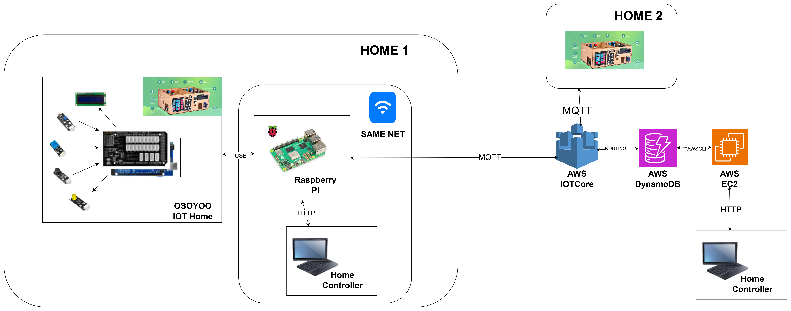

# Laboratorio IOT para Digitalización DAM en Cuatrovientos

## Creador por y para

> @author: Miguel Goyena. <miguel_goyena@cuatrovientos.org>

Basado en el proyecto creado por Ander Frago <ander_frago@cuatrovientos.org> en [GITHUB de Ander Frago para E4M](https://github.com/anderfrago/smarthome-lessons)

Creado para la asignatura de Digitalización para 1º DAM

## Arquitectura general de la plataforma

Los elementos HW clave para la plataforma son:

- **Casa física Osoyoo**:  [Smart Home OSOYOO](https://osoyoo.com/es/2019/10/18/osoyoo-smart-home-iot-learning-kit-with-mega2560-introduction/), incluye sensores, Arduino y una placa IOT
- **Raspberry PI**: Para darle conectividad a la casa y poder controlarla en local.
- **Entorno Cloud AWS**: Para poder controlar más de una casa al mismo tiempo desde cualquier lugar con acceso a internet.

Los elementos SW clave para la plataforma son:

- **slave**: [SW para Arduino](slave/README.md) para manejar sensores y accionadores, sin UI, simplemente acceso mediante USB. 
- **master**: [SW para Raspberry](master/README.md) para tener una UI para la casa en Local y darle acceso al entorno cloud en AWS.
 - **cloud**: [SW para Raspberry](cloud/README.md) para tener una UI para la casa en Remoto, explota la información de AWS y permite controlar todas las casas conectadas al entorno CLOUD.
