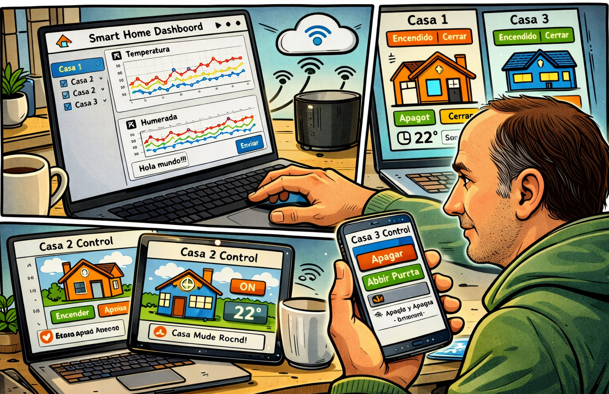

# Laboratorio IOT para Digitalización DAM en Cuatrovientos

## Creador por y para

> @author: Miguel Goyena. <miguel_goyena@cuatrovientos.org>

Basado en el proyecto creado por Ander Frago <ander_frago@cuatrovientos.org> en [GITHUB de Ander Frago para E4M](https://github.com/anderfrago/smarthome-lessons)

Creado para la asignatura de Digitalización para 1º DAM

## Arquitectura general de la plataforma

Los elementos HW clave para la plataforma son:

- **Casa física Osoyoo**:  [Smart Home OSOYOO](https://osoyoo.com/es/2019/10/18/osoyoo-smart-home-iot-learning-kit-with-mega2560-introduction/), incluye sensores, Arduino y una placa IOT
- **Raspberry PI**: Para darle conectividad a la casa y poder controlarla en local.
- **Entorno Cloud AWS**: Para poder controlar más de una casa al mismo tiempo desde cualquier lugar con acceso a internet.

Los elementos SW clave para la plataforma son:

- **slave**: [SW para Arduino](slave/README.md) para manejar sensores y accionadores, sin UI, simplemente acceso mediante USB. 
- **master**: [SW para Raspberry](master/README.md) para tener una UI para la casa en Local y darle acceso al entorno cloud en AWS.
 - **cloud**: [SW para Raspberry](cloud/README.md) para tener una UI para la casa en Remoto, explota la información de AWS y permite controlar todas las casas conectadas al entorno CLOUD.

## Casos de Uso a implementar

Esta es una lista de casos de uso para poder implementar a partir de esta POC.
Si se va a implementar algun caso de uso se recomienda hacer una rama por cada caso de uso.

### Controlar las luces de mi casa de forma remota

Juan es el dueño de la casa domotizada y ya está harto de dejarse las luces de su casa encendida. Entonces quiere tener un control remoto de las luces de su casa.

La casa tiene:

- Sus 3 LEDS individuales, ROJO, VERDE, y AMARILLO. 
- Su luz RGB, donde puede poner el color que más le interese.
- Su luz blanca en el exterior de su casa.
- Quiere tener una interfaz WEB para ver el estado de todas sus luces y poder encender y apagar de forma individual las luces. En el caso del RGB quiere poner el color que quiera.

### Vigilar al abuelo

Juan tiene a su abuelo en casa, pero cuando va a trabajar quiere tenerlo vigilado de alguna forma. Por lo tanto Juan ha puesto un botón Rojo y un Botón azul en la casa.

- El abuelo de Juan pulsa el botón ROJO cuando tiene alguna urgencia
- El abuelo de Juan pulsa el botón AZUL cuando tiene algo de hambre.

Juan tiene siempre en su móvil la aplicacion web de monitorización y quiere enterarse de esos 2 eventos. 
- Si el abuelo de Juan tiene hambre se le va a abrir la puerta del frigorífico de forma remota. Pero tiene que ser Juan quien la abra y ademas encienda la luz de la cocina (LED Verde). 
- Si el abuelo de Juan tiene una Urgencia, podríamos mandar un mensaje a whatsup/telegram/discord ??

### Acceso infantil a la casa

Juan tiene un hijo al cual no se fia para entregarle la llave de casa, la ha perdido muchas veces y cada vez que la pierde tiene que cambiar el sistema de entrada. Entonces ha pensado que es mejor utilizar una clave numérica.

Si su hijo introduce el código de 4 números que se elije, Juan puede ver en su centro de mando que hay una petición de entrada. Podrá detectar que su hijo está a menos de 10 cm de la puerta y abrirá la puerta de la casa durante 15 segundos y luego la cerrara. Pondrá en la pantalla LED un mensaje dando la bienvenida a su hijo. Si el hijo no esta cerca le pondrá que se acerque más a la puerta.

### Activación de la alarma de forma remota

La casa de Juan tiene 2 modos de funcionamiento.

- En casa: Que es cuando están en casa, se quiere monitorizar la temperatura y la humedad.
- Fuera de casa: En este modo se va a ver si detecta si hay alguien en la casa. Si se detecta alguién, si se detecta que hay fuego o hay gas entonces el Buzzer empezara a sonar.

Juan podrá cambiar de modo de la casa de forma remota y podrá quitar el buzzer si quiere.

### Quiero saber el tiempo para mañana

Juan es muy curioso y quiere que los que estén en el exterior de la casa sepan el tiempo que va a hacer mañana. A quien no le gustan los termómetros de las farmacias!!!

Por lo tanto cada vez que Juan pulse el botón rojo de la casa, se va a actualizar el tiempo en la pantalla LCD de la casa. El reto de este caso de uso es que el tiempo en cada localidad donde está la casa se debe de consultar desde la aplicación CLOUD mediante el API de Openweather.

- Cuando registras la casa en la APP Master, debes de indicar el nombre de la casa y también la localidad donde está.
- Cuando llegue un evento de botón rojo activado en una casa determinada entonces el SW Cloud va a consultar a Openweather (REST API) el tiempo de mañana.
- Se pone ese tiempo en el LCD.