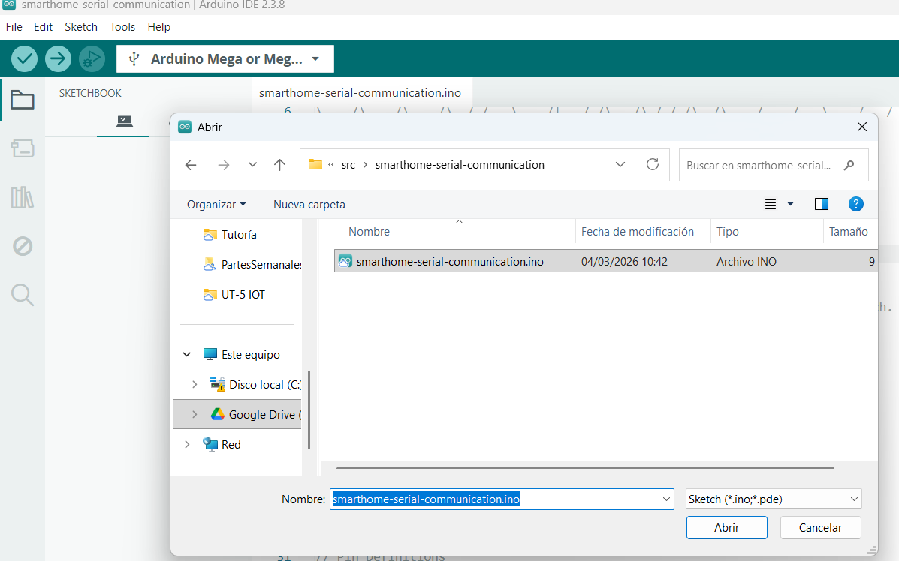
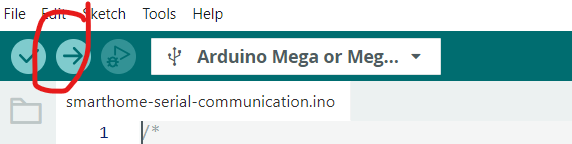
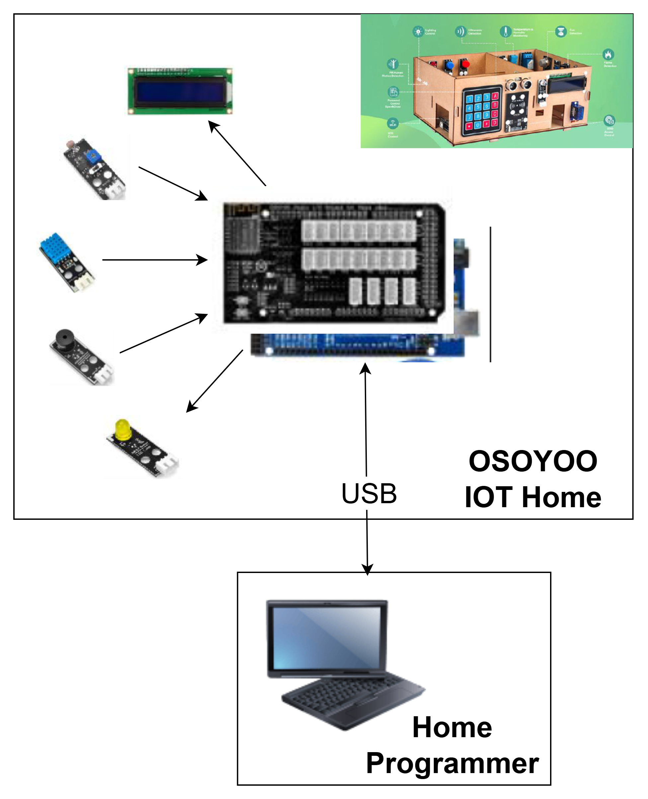

# 🏠 SmartHome IoT con Arduino  
### Control de vivienda mediante comunicación por puerto serie


Proyecto de automatización de una vivienda basado en Arduino, que permite controlar distintos dispositivos mediante comunicación por puerto serie.

---

## 📌 Descripción

Este proyecto implementa un sistema de **casa inteligente ([Smart Home OSOYOO](https://osoyoo.com/es/2019/10/18/osoyoo-smart-home-iot-learning-kit-with-mega2560-introduction/))** donde un Arduino actúa como controlador principal (modo *slave*), gestionando sensores y actuadores, y comunicándose con un sistema externo.

---

## 📁 Estructura del proyecto

```
📦 repo
 ┣ 📂 src
 ┃ ┗ 📜 smarthome-serial-communication.ino
 ┗ 📜 README.md
```

- `src/` → Contiene el software que se carga en Arduino, junto con lkas librerias necesarias  
- `.ino` → Programa principal del sistema  

---

## ⚙️ Requisitos

Antes de empezar, necesitas:

- 🧰 [Arduino IDE](https://www.arduino.cc/en/software/)  
- 🔗 Cable USB  
- 📚 Librerías necesarias, incluidas en el REPO:
  - DHT
  - Keypad
  - LiquidCrystal_I2C
  - RFID

---

## 🚀 Instalación


### 1. Abrir el proyecto

- Abrir **Arduino IDE**
- Ir a:
  ```
  slave/src/smarthome-serial-communication/smarthome-serial-communication.ino
  ```

---

### 2. Instalar librerías

En Arduino IDE:

```
Sketch → Include Library → Manage Libraries
```

Instalar:

- DHT  
- Keypad  
- LiquidCrystal_I2C  
- RFID  

---

### 3. Conectar Arduino

- Conecta el Arduino al PC mediante USB  
- Selecciona:
  - **Herramientas → Placa**
  - **Herramientas → Puerto**

---

### 4. Subir el código

- Pulsa el botón **Upload (→)**



---

## 🔌 Arquitectura del sistema



---

## 🧠 Funcionalidades

✔ Lectura de sensores (temperatura, humedad, fuego, luz, microfono, distancia, presencia, gas)  
✔ Manejo de las luces (Leds y RGB)  
✔ Entrada de teclado y RFID 
✔ Escritura en pantalla LCD  
✔ Manejo de motor para puerta de entrada
✔ Buzzer
✔ Comunicación por puerto serie USB  

---

## ⚠️ Notas importantes

- Instala todas las librerías antes de subir el código  
- Verifica el puerto serie si Arduino no es detectado  
- Compatible con múltiples placas Arduino  
- Se incluye el [manual original de Osoyoo](./ManualUsuarioOsoyoo.pdf) para poder ampliar funcionalidades

---

## 👨‍💻 Recomendación

💡 Se recomienda revisar el código fuente para entender completamente el funcionamiento del sistema y poder ampliarlo.


---

## 🙌 Autor

Miguel Goyena basado en el proyecto [GITHUB de Ander Frago para E4M](https://github.com/anderfrago/smarthome-lessons) 
